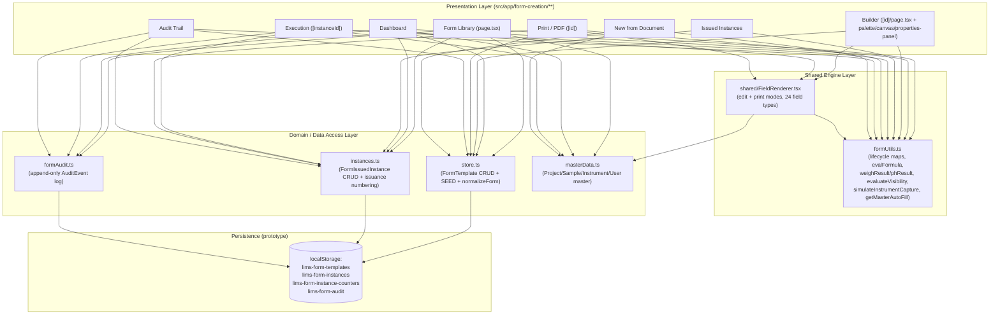
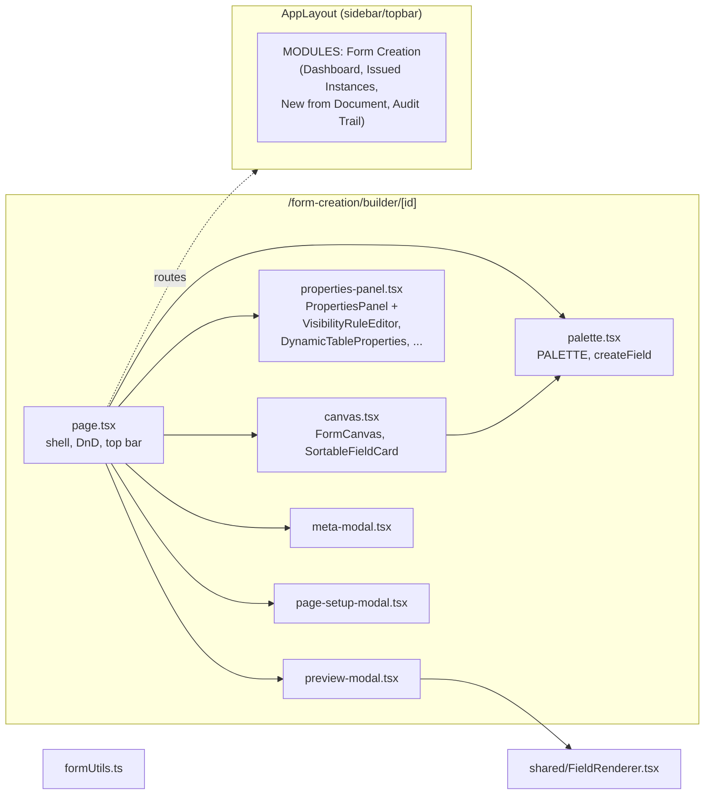
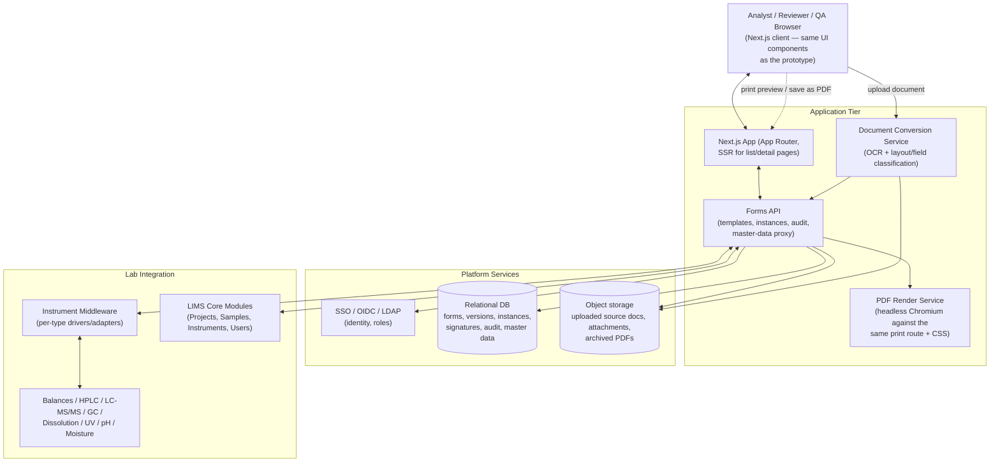

# System Architecture

Deliverable **(3)**. Three views: logical, component, and deployment (production target).
The prototype implements the full logical and component architecture client-side; the
deployment view shows how the same components map onto a production service
topology.

## 1. Logical Architecture

### Key architectural decisions

- **Single shared rendering engine.** `FieldRenderer` is the only place that knows how
  to draw each of the 24 `FieldType`s. It is parameterised by `mode: 'edit'|'print'`
  and used unmodified by the Builder's Preview, the Execution screen, and the Print
  engine — eliminating triplicated rendering logic and guaranteeing visual/behavioural
  parity between "what you design", "what you fill in" and "what you print".
- **Single source of truth for taxonomies.** `formUtils.ts` centralises every
  label/colour/transition map (`STATUS_LABEL`/`STATUS_STYLE`/`STATUS_FLOW`/`TONE_STYLE`,
  `INSTANCE_STATUS_LABEL`/`INSTANCE_STATUS_STYLE`, `AUDIT_CATEGORY_LABEL`/`_COLOR`) so the
  Form Library, Builder, Dashboard, Instances and Audit Trail never disagree on what a
  status means or looks like.
- **Snapshot-on-issue.** `issueForm()` copies the template's `pages`/`header`/`footer`/
  `orientation` into the new `FormIssuedInstance`. The Print engine and Execution screen
  always prefer the **instance's own snapshot** over the live template
  (`instance?.pages ?? form?.pages`), so later template edits cannot retroactively
  change a document that has already been issued/executed/printed.
- **Append-only audit log as a side effect, not an afterthought.** Every mutating
  action in the Form Library, Builder (Page Setup), and Execution screen calls
  `logAuditEvent()` in the same handler that performs the mutation — there is no
  separate "audit sync" step to forget.

## 2. Component / Module Architecture

The Builder itself is split into focused files so that the field-type matrix (palette
defaults, canvas badges, properties editors) can grow without the orchestration shell
(`page.tsx`) growing in lockstep.

## 3. Deployment Architecture (Production Target)

### Mapping prototype → production

| Prototype module | Production component |
|---|---|
| `store.ts` (`localStorage` templates) | Forms API `/templates` + DB `form_templates`/`form_versions` tables |
| `instances.ts` (`localStorage` instances + counters) | Forms API `/instances` + DB `form_instances` table with a DB sequence per `(form_no, major_version, year)` |
| `formAudit.ts` (`localStorage` audit log) | Forms API `/audit-events` + append-only DB table (no UPDATE/DELETE grants) |
| `masterData.ts` (seeded arrays) | Read-through proxy to LIMS Core (Projects/Samples/Instruments/Users) |
| `simulateInstrumentCapture` | Instrument Middleware adapters (one per `InstrumentType`) — see [`09-instrument-integration.md`](./09-instrument-integration.md) |
| `upload/page.tsx` "AI" simulation | Document Conversion Service (OCR + ML field classification) producing the same draft-`FormTemplate` shape |
| `print/[id]/page.tsx` + `window.print()` | Same route rendered headlessly by the PDF Render Service for archival PDFs, in addition to interactive client print |
| Hardcoded `CURRENT_USER` | SSO/OIDC session, role drives `STATUS_FLOW`/signature-meaning availability |
