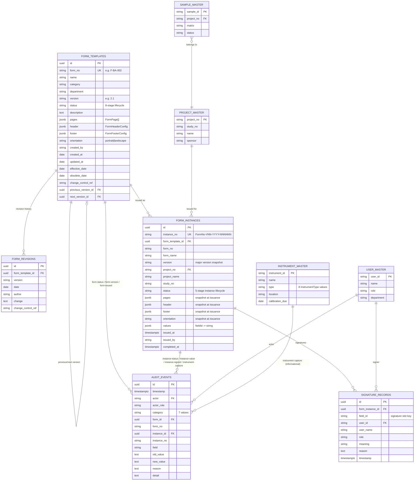

# Data Model

Deliverables **(4)** Database design and **(15)** Data model for forms, templates,
versions, issued instances, master data and audit. Reflects the shapes defined in
`src/app/form-creation/types.ts` and seeded/used by `store.ts`, `instances.ts`,
`formAudit.ts` and `masterData.ts`.

## 1. Modelling Approach

A form's **content** (`pages` → `fields`, each of 24 heterogeneous `FieldType`s with
type-specific optional properties — see §4) is naturally **document-shaped**: it is
always read and written as a whole (the Builder saves the entire template; the
Execution screen and Print engine read the entire instance snapshot), and its shape
varies per field type in ways that would require dozens of nullable columns or a
field-type-per-table design if fully normalized.

The production data model therefore uses a **hybrid** approach:

- **Relational tables** for entities that are queried, filtered, joined and reported on
  independently of form content: templates (header row), revisions, instances (header
  row), signature records, audit events, and all master data.
- **JSONB columns** for `pages` (and the small `header`/`footer` config objects) on
  both `form_templates` and `form_instances`, validated against the JSON Schema in §4
  — directly serialising `FormPage[]` / `FormHeaderConfig` / `FormFooterConfig`.

This mirrors the prototype exactly: `store.ts`/`instances.ts` already serialise the
entire `FormTemplate`/`FormIssuedInstance` object (including `pages`) to a single
`localStorage` value; the production model simply moves that JSON blob into a JSONB
column while pulling the frequently-queried scalar fields out into real columns.

## 2. Entity-Relationship Diagram



## 3. Table Specifications

### `form_templates`

| Column | Type | Notes |
|---|---|---|
| `id` | UUID PK | prototype: `f-${Date.now()}` style string id |
| `form_no` | varchar, unique | e.g. `F-BA-001`; format `F-<DeptInitials>-<seq3>` for upload-generated drafts |
| `name`, `category`, `department`, `description` | text | `category` ∈ `CATEGORIES`, `department` ∈ `DEPARTMENTS` (`formUtils.ts`) |
| `version` | varchar | e.g. `"2.1"`; major version = `floor(parseFloat(version))` |
| `status` | enum | `draft \| under-review \| qa-review \| approved \| effective \| live \| obsolete \| archived` |
| `pages` | jsonb | `FormPage[]` — see §4 |
| `header` | jsonb | `{ companyName, showLogo, watermarkText? }` |
| `footer` | jsonb | `{ showPageNumbers, showQrCode, showAuditRef }` |
| `orientation` | enum | `portrait \| landscape` |
| `created_by`, `created_at`, `updated_at` | text/date | `updated_at` refreshed on every status change |
| `effective_date`, `obsolete_date` | date, nullable | set automatically when status transitions to `effective`/`obsolete` |
| `change_control_ref` | varchar, nullable | optional CR reference for the current version |
| `previous_version_id`, `next_version_id` | UUID FK → `form_templates.id`, nullable | bidirectional version chain created by "Create New Version" |

### `form_revisions`

One row per `RevisionEntry`. Append-only; `form_templates.id` + ordering by `date`
reconstructs `revisionHistory: RevisionEntry[]`.

| Column | Type | Notes |
|---|---|---|
| `id` | UUID PK | |
| `form_template_id` | UUID FK | |
| `version` | varchar | |
| `date` | date | |
| `author` | varchar | |
| `change` | text | free-text change description |
| `change_control_ref` | varchar, nullable | |

### `form_instances`

| Column | Type | Notes |
|---|---|---|
| `id` | UUID PK | prototype: `inst-${Date.now()}-${rand4}` |
| `instance_no` | varchar, unique | see [`05-workflows-and-approvals.md`](./05-workflows-and-approvals.md) for the numbering algorithm |
| `form_template_id`, `form_no`, `form_name`, `version` | FK/text | `version` is the **major** version at issuance (e.g. `"02"`), not the full template version |
| `project_no`, `project_name`, `study_no` | text/FK | from `PROJECT_MASTER` at issuance |
| `status` | enum | `issued \| in-progress \| under-review \| completed \| approved` |
| `pages`, `header`, `footer`, `orientation` | jsonb/enum | **snapshot** copied from the template at issuance — never re-synced |
| `values` | jsonb | `Record<fieldId, string>`; also holds derived keys for instrument captures (`${id}__unit`, `${id}__instrument`, `${id}__instrumentName`, `${id}__timestamp`, `${id}__operator`) |
| `issued_at`, `issued_by` | timestamptz/text | |
| `completed_at` | timestamptz, nullable | set when status → `completed` |

### `signature_records`

Normalises the prototype's `signatures: Record<string, SignatureRecord>` map (keyed by
field id, or `${stepFieldId}_${stepId}__sign` for step-section sign-offs).

| Column | Type | Notes |
|---|---|---|
| `id` | UUID PK | |
| `form_instance_id` | UUID FK | |
| `field_id` | varchar | the map key — identifies which signature slot |
| `user_id`, `user_name`, `role` | varchar | signer identity at time of signing |
| `meaning` | enum | one of `SIGNATURE_MEANINGS`: Performed By, Reviewed By, Approved By, Witnessed By, Verified By, Authorised By |
| `reason` | text, nullable | |
| `timestamp` | timestamptz | |

### `audit_events`

Append-only (no UPDATE/DELETE grants in production — see
[`07-audit-trail-and-part11.md`](./07-audit-trail-and-part11.md)).

| Column | Type | Notes |
|---|---|---|
| `id` | UUID PK | prototype: `aud-${Date.now()}-${rand4}` |
| `timestamp` | timestamptz | |
| `actor`, `actor_role` | varchar | from `USER_MASTER` |
| `category` | enum | `form-status \| form-version \| form-issued \| instance-status \| instance-value \| instance-signed \| instrument-capture` |
| `form_id`, `form_no` | FK/varchar, nullable | |
| `instance_id`, `instance_no` | FK/varchar, nullable | |
| `field`, `old_value`, `new_value`, `reason` | varchar/text, nullable | populated for value-correction and status-change events |
| `detail` | text | human-readable summary shown in the Audit Trail and Dashboard feed |

### Master data tables

`project_master`, `sample_master`, `instrument_master`, `user_master` mirror
`ProjectMasterEntry`, `SampleMasterEntry`, `InstrumentMasterEntry`, `UserMasterEntry`
from `types.ts`. In production these are **not owned** by the e-Form module — they are
read-through views/proxies onto the LIMS Projects, Sample Management, Instrument
Management and User Management modules respectively (see
[`03-architecture.md`](./03-architecture.md) §3).

| Table | Key columns |
|---|---|
| `project_master` | `project_no` PK, `study_no`, `name`, `sponsor` |
| `sample_master` | `sample_id` PK, `project_no` FK, `matrix`, `status` |
| `instrument_master` | `instrument_id` PK, `name`, `type` (8-value `InstrumentType` enum), `location`, `calibration_due` |
| `user_master` | `user_id` PK, `name`, `role`, `department` |

## 4. `pages` JSON Schema (`FormPage[]`)

Stored verbatim as JSONB on both `form_templates.pages` and `form_instances.pages`.

```
FormPage:
  id: string
  title: string
  fields: FormField[]

FormField (id, type, label, required always present; remainder optional
           and grouped by which field type(s) use them):
  id, type (1 of 24 FieldType), label, required, placeholder?, helpText?

  # number
  unit?, decimals?, numMin?, numMax?

  # dropdown / radio
  options?            # comma-separated string

  # weigh-slip / instrument-capture
  targetWeight?, weightUnit?, toleranceMin?, toleranceMax?,
  passLabel?, failLabel?, reweighLabel?

  # ph-slip
  targetPH?, phMin?, phMax?

  # calculation
  formula?, calcUnit?, calcDecimals?

  # table / dynamic-table
  columns?: TableColumn[]   # { id, header, type: text|number|dropdown|subtable,
                             #   options?, width?, subColumns?: {id,header}[] }
  allowAddRows?, defaultRows?, minRows?, maxRows?

  # e-signature
  signatureRole?, requirePassword?

  # section-header / instruction
  content?

  # step-section
  steps?: FormStep[]   # { id, title, instruction?, fields: StepInlineField[],
                        #   hasSignDate, attachmentLabel? }

  # smart fields (sample-id / project-id / instrument / user-field)
  masterBinding?: 'project' | 'sample' | 'instrument' | 'user'

  # instrument-capture
  instrumentType?: InstrumentType (8 values), captureUnit?

  # any field
  visibilityRule?: { fieldId, operator (8 values), value? }
```

## 5. Persistence Keys (Prototype)

| `localStorage` key | Shape | Managed by |
|---|---|---|
| `lims-form-templates` | `FormTemplate[]` | `store.ts` |
| `lims-form-instances` | `FormIssuedInstance[]` | `instances.ts` |
| `lims-form-instance-counters` | `Record<"<formNo>-V<NN>-<year>", number>` | `instances.ts` |
| `lims-form-audit` | `AuditEvent[]` (newest first) | `formAudit.ts` |
