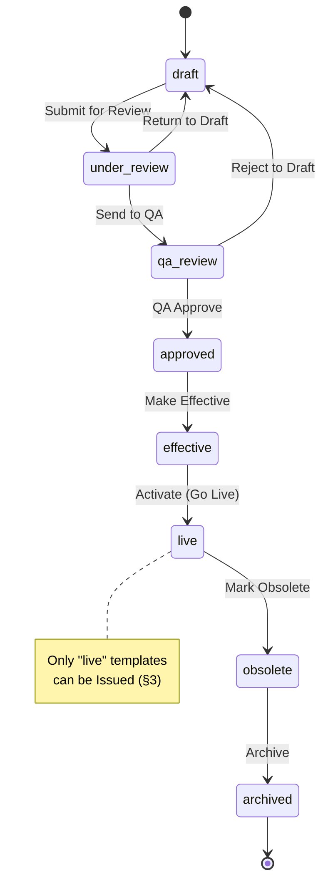
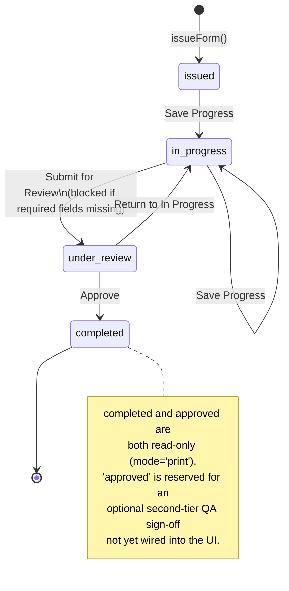

# Workflows & Approvals

Deliverables **(6)** Lifecycle/approval workflow and **(12)** Issuance numbering
rules. Single source of truth for the maps below is `src/app/form-creation/formUtils.ts`.

## 1. Form Template Lifecycle (8 stages)



| State | Label | Style | Meaning |
|---|---|---|---|
| `draft` | Draft | neutral | Being authored/edited in the Builder |
| `under-review` | Under Review | info (blue) | Submitted for technical review |
| `qa-review` | QA Review | warning (amber) | Forwarded to QA |
| `approved` | Approved | info (blue) | QA-approved, awaiting effective date |
| `effective` | Effective | success (green) | Approved and dated, not yet activated for use |
| `live` | Live | success (green) | Active — usable for issuance |
| `obsolete` | Obsolete | warning (amber) | Superseded/withdrawn, retained for reference |
| `archived` | Archived | danger (red) | Final, retained for retention period only |

`STATUS_FLOW` (in `formUtils.ts`) defines, per status, the list of `{label, next,
tone}` transitions shown as buttons in the Form Library row actions and the Builder
top bar. `archived` has no outgoing transitions (terminal).

### Transition table & responsible role

| From | Action | To | Tone | Typical actor (persona) |
|---|---|---|---|---|
| `draft` | Submit for Review | `under-review` | info | Analyst (author) |
| `under-review` | Send to QA | `qa-review` | info | Study Director / Principal Investigator (reviewer) |
| `under-review` | Return to Draft | `draft` | warning | Reviewer (sends back for rework) |
| `qa-review` | QA Approve | `approved` | success | QA Reviewer |
| `qa-review` | Reject to Draft | `draft` | danger | QA Reviewer |
| `approved` | Make Effective | `effective` | success | QA Approver / Document Control |
| `effective` | Activate (Go Live) | `live` | success | QA Approver / Document Control |
| `live` | Mark Obsolete | `obsolete` | warning | Document Control |
| `obsolete` | Archive | `archived` | danger | Document Control |

Every transition (`page.tsx: updateStatus`):
1. Sets `updatedAt` to today.
2. If the new status is `effective`, sets `effectiveDate` to today.
3. If the new status is `obsolete`, sets `obsoleteDate` to today.
4. Logs a `form-status` `AuditEvent` with `oldValue`/`newValue` set to the old/new
   `STATUS_LABEL` and a human-readable `detail`.

> **Production role gating.** The prototype exposes every valid transition to the
> single demo user. In production, `STATUS_FLOW` transitions would additionally be
> filtered by the signed-in user's role (e.g. only QA roles see *QA Approve* / *Reject
> to Draft* / *Make Effective* / *Activate*), per [`02-srs.md`](./02-srs.md) NFR-S.1.

## 2. Form Instance Lifecycle (Execution)



| State | Label | Meaning |
|---|---|---|
| `issued` | Issued | Created via Issue Form to Project; nothing filled in yet |
| `in-progress` | In Progress | Analyst is actively filling it in (Save Progress) |
| `under-review` | Under Review | Submitted; awaiting Approve/Return |
| `completed` | Completed | Approved; `completedAt` set; read-only |
| `approved` | Approved | Defined in `InstanceStatus` and treated as read-only equivalent to `completed`; reserved for a future explicit secondary-approval step |

Every transition (`execute/[instanceId]/page.tsx`) logs an `instance-status`
`AuditEvent` via `logStatusChange(oldStatus, newStatus, detail)`.

### Required-field gate on "Submit for Review"

`getMissingRequiredFields()` walks every page/field where:
- `evaluateVisibility(f.visibilityRule, values)` is `true` (hidden fields are exempt — FR-4.3), **and**
- the field's type is not in `NON_VALUE_TYPES` (layout-only types), **and**
- `f.required` is `true`, **and**
- either `values[f.id]` is empty (normal fields) or `signatures[f.id]` is absent (`e-signature` fields).

If this list is non-empty, "Submit for Review" is blocked and the missing fields are
listed to the user.

## 3. Issuance Numbering

Issuance is only available for templates with status `live` (Form Library → **Issue**
action → pick a Project from `PROJECT_MASTER` → `issueForm(template, project,
issuedBy)`).

### Format

```
<FormNo>-V<MajorVersion, 2-digit>-<Year>-<Sequence, 6-digit>
```

Example: `F-BA-002-V02-2026-000001` — Form `F-BA-002`, major version **02** (from
template version `"2.x"`), issued in **2026**, sequence **000001**.

### Algorithm (`instances.ts`)

```
majorVersion(version) = pad2( floor(parseFloat(version)) || 1 )

counterKey = "<formNo>-V<majorVersion>-<year>"
sequence   = nextSequence(counterKey)   // ++ a persisted per-key counter, starting at 1

instanceNo = "<formNo>-V<majorVersion>-<year>-" + pad6(sequence)
```

- The counter is keyed by **(form number, major version, calendar year)** — so
  `F-BA-002-V02-2026-…` and `F-BA-002-V03-2026-…` (after a major version bump) have
  independent sequences, and the sequence resets for each new year.
- The counter is persisted (`lims-form-instance-counters` in the prototype; a DB
  sequence/row-lock in production — [`02-srs.md`](./02-srs.md) NFR-A.4) so an instance
  number is **never reused**, even if instances are later deleted.
- `buildInstanceNo(template, year, seq)` is the pure formatting function; `issueForm`
  is the side-effecting wrapper that allocates the next sequence and writes the
  instance.

### What gets snapshotted at issuance

`issueForm` copies `template.pages`, `template.header`, `template.footer`,
`template.orientation` into the new `FormIssuedInstance`, plus `formId`, `formNo`,
`formName`, the **full** `template.version` string, and `projectNo`/`projectName`/
`studyNo` from the selected `PROJECT_MASTER` entry. `values` and `signatures` start
empty; `status` starts as `issued`.

A `form-issued` `AuditEvent` is logged, and the user is shown the new instance number
with a link to **Issued Instances**.

## 4. Versioning Workflow ("Create New Version")

Available from the Builder's **Page Setup** modal, only when the current template has
no `nextVersionId` (i.e. no newer draft already branched from it).

```mermaid
sequenceDiagram
    actor Author
    participant PSM as Page Setup Modal
    participant Builder as Builder (page.tsx)
    participant Store as store.ts
    participant Audit as formAudit.ts

    Author->>PSM: Create New Version
    PSM->>PSM: suggestNextVersion(form.version)\n("2.1" -> "2.2"; non-"X.Y" left unchanged)
    Author->>PSM: confirm version, change description, change-control ref
    PSM->>Builder: onCreateVersion({version, change, changeControlRef})
    Builder->>Builder: newForm = clone(form) with new id, version,\nstatus="draft", previousVersionId=form.id,\nrevisionHistory += new entry
    Builder->>Builder: updatedCurrent = {...form, nextVersionId: newForm.id}
    Builder->>Store: upsertForm(updatedCurrent)
    Builder->>Store: upsertForm(newForm)
    Builder->>Audit: logAuditEvent(category="form-version", ...)
    Builder->>Author: stay on current (now-linked) template
```

Key properties:

- `suggestNextVersion("2.1")` → `"2.2"` (regex `^(\d+)\.(\d+)$`, increments the minor
  version); the author may override the suggestion.
- The **new** template is created as a fresh record (`form-${Date.now()}`), status
  `draft`, with `effectiveDate`/`obsoleteDate` cleared and `previousVersionId` pointing
  back at the current template.
- The **current** template is updated only with `nextVersionId` pointing at the new
  draft — its own status/version/history are otherwise untouched, so it remains `live`
  (or whatever it was) and continues to be issuable until the new version completes its
  own lifecycle and itself goes `live`.
- Both templates' `revisionHistory` arrays converge: the new template's history is the
  old history **plus** the new entry (so the full lineage is visible from either
  version's Page Setup).
- A `form-version` audit event records `oldValue`/`newValue` as `vX.Y` strings and a
  detail line including the change-control reference if supplied.

While `form.nextVersionId` is set, Page Setup shows a notice ("a newer version already
exists in draft") instead of the "Create New Version" button — preventing
fork/diamond version graphs.
