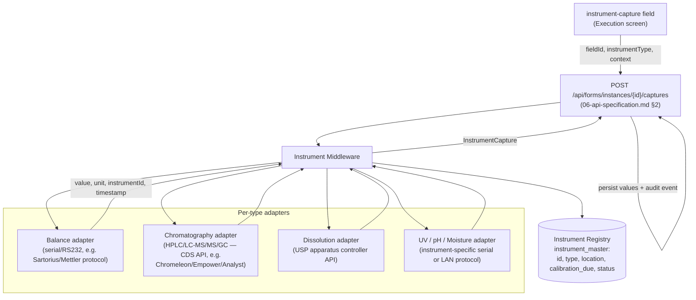

# Instrument Integration Architecture

Deliverable **(13)**. Covers the `instrument-capture` field type, the 8 supported
`InstrumentType`s, the prototype's simulation, and the production integration design.

## 1. Supported Instrument Types

`types.ts: InstrumentType` defines 8 values, each seeded in `INSTRUMENT_MASTER`
(`masterData.ts`) with a realistic instrument, location and calibration-due date:

| `InstrumentType` | `INSTRUMENT_TYPE_LABEL` | Seeded instrument | Location | Default `captureUnit` |
|---|---|---|---|---|
| `balance` | Balance | BAL-001 Sartorius MSE Analytical Balance / BAL-002 Mettler Toledo XS205 | Weighing Room 1 / 2 | `mg` |
| `hplc` | HPLC | HPLC-01 Agilent 1260 Infinity II | HPLC Lab | `AU` |
| `lcms` | LC-MS/MS | LCMS-01 Sciex Triple Quad 6500+ | LCMS Suite | `cps` |
| `gc` | GC | GC-01 Agilent 8890 GC System | GC Lab | `AU` |
| `dissolution` | Dissolution Tester | DISS-01 Distek 2500 Dissolution Tester | Dissolution Lab | `%` |
| `uv` | UV Spectrophotometer | UV-01 Shimadzu UV-1900i Spectrophotometer | QC Lab | `AU` |
| `ph-meter` | pH Meter | PH-01 Mettler Toledo SevenCompact pH Meter | Sample Prep | `pH` |
| `moisture-analyzer` | Moisture Analyzer | MOI-01 Sartorius MA37 Moisture Analyzer | QC Lab | `%RH` |

`DEFAULT_CAPTURE_UNIT` (`formUtils.ts`) supplies the unit above when a field doesn't
override `captureUnit`.

## 2. `instrument-capture` Field Type

Configured (Builder → Smart Fields → Instrument Capture, `createField`) with:

```ts
{
  type: 'instrument-capture',
  instrumentType: 'balance',     // one of the 8 InstrumentType values
  captureUnit: 'mg',              // overrides DEFAULT_CAPTURE_UNIT
  targetWeight?, toleranceMin?, toleranceMax?,  // optional — enables tolerance-aware generation
  calcDecimals?,                  // precision of the captured value
}
```

Rendered by `shared/FieldRenderer.tsx: InstrumentCaptureField` as:

```
┌─────────────────────────────────────────────────────────┐
│  [ Capture from Instrument ]                              │
└─────────────────────────────────────────────────────────┘
   ↓ after capture / re-capture
┌─────────────────────────────────────────────────────────┐
│  Value: 50.12 mg                                          │
│  Instrument: BAL-001 — Sartorius MSE Analytical Balance   │
│  Captured: 2026-06-10 14:01:55 by A. Liang                │
│  [ Re-capture ]                                            │
└─────────────────────────────────────────────────────────┘
```

On capture, `execute/[instanceId]/page.tsx: handleCapture` writes these keys into the
instance's `values` map:

| Key | Meaning |
|---|---|
| `{fieldId}` | the captured value (string, formatted to `calcDecimals` / type default) |
| `{fieldId}__unit` | the unit (`captureUnit` or `DEFAULT_CAPTURE_UNIT[instrumentType]`) |
| `{fieldId}__instrument` | the instrument's `instrumentId` (e.g. `BAL-001`) |
| `{fieldId}__instrumentName` | the instrument's display name |
| `{fieldId}__timestamp` | `Date().toLocaleString()` at capture time |
| `{fieldId}__operator` | `CURRENT_USER.name` — who triggered the capture |

...and logs an `instrument-capture` `AuditEvent` (re-capturing logs a **new** event
without erasing the previous one — both remain in the audit trail).

## 3. Prototype Simulation (`simulateInstrumentCapture`)

```ts
function simulateInstrumentCapture(field, instruments): InstrumentCapture {
  // 1. pick a candidate instrument of the field's instrumentType,
  //    falling back to any instrument if none match
  // 2. decimals = field.calcDecimals ?? (instrumentType === 'balance' ? 4 : 2)
  // 3. value:
  //    - if field.targetWeight is set: targetWeight * (1 ± drift),
  //      where drift is bounded by max(toleranceMax - 100, 0.5)% — i.e. the
  //      simulated reading is plausible relative to the configured tolerance
  //    - else: a representative random value (0-100)
  // 4. unit = field.captureUnit || DEFAULT_CAPTURE_UNIT[instrumentType] || ''
  // 5. timestamp = new Date().toLocaleString()
}
```

This gives weigh-slip-style `instrument-capture` fields a value that lands inside (or
just outside, exercising Pass/Fail/Reweigh) the configured tolerance band, while
non-weight fields get a plausible reading in the field's unit.

## 4. Production Architecture



### Integration approach per instrument family

| Instrument family | Typical interface | Middleware responsibility |
|---|---|---|
| **Balances** (`balance`) | RS-232/USB serial, vendor protocol (e.g. Sartorius MSE, Mettler Toledo SevenCompact) | Parse the weight/unit/stability frame, correlate to the requesting `fieldId`/instance |
| **HPLC / LC-MS/MS / GC** (`hplc`, `lcms`, `gc`) | Chromatography Data System (CDS) API (e.g. Empower, Chromeleon, Analyst) | Pull the relevant result/peak value for the run referenced by the instance's sample/batch |
| **Dissolution Tester** (`dissolution`) | Apparatus controller network API | Pull % dissolution at the configured timepoint |
| **UV Spectrophotometer / pH Meter / Moisture Analyzer** (`uv`, `ph-meter`, `moisture-analyzer`) | Serial/LAN, vendor SDK | Parse absorbance/pH/%RH reading |

All adapters return a common `InstrumentCapture` shape (`{ value, unit, instrumentId,
instrumentName, timestamp }`) — identical to the prototype's simulated return value —
so `/api/forms/instances/{id}/captures` and the Execution screen need no per-type
branching beyond the `instrumentType` already on the field.

### Authority / device checks (Part 11 §11.10(h))

Before returning a capture, the Middleware should:

1. Verify the resolved instrument's `calibration_due` is in the future (refuse capture,
   or flag the resulting value, if overdue — surfaced today only as a Dashboard ALCOA+
   metric: "`M`/`N` instruments due for calibration within 30 days").
2. Verify the instrument is registered for the location/department of the requesting
   instance's project.
3. Record the instrument's firmware/serial identity alongside `instrumentId` for full
   traceability in the `instrument-capture` audit event.

## 5. Calibration Tracking

`INSTRUMENT_MASTER[].calibrationDue` is read by the Dashboard's **Accurate** ALCOA+
metric (`dashboard/page.tsx`):

```
calibrationDueSoon = count(instruments where calibrationDue <= today + 30 days)
```

In production this would be sourced live from the LIMS Instrument Management module
(calibration certificates, PM schedules) rather than a static seed, and the Middleware
would enforce it at capture time as above.
